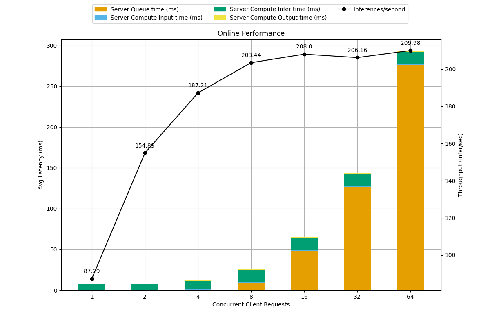
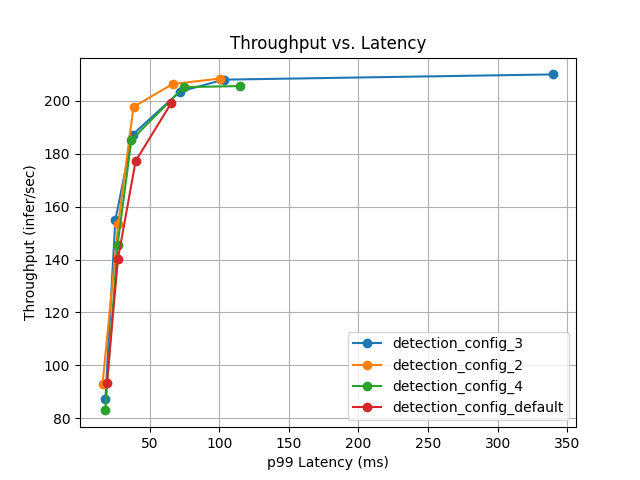

# Простой пример инференса YOLO
## 1. Инференс с помощью Triton Inference Server
Для начала инференса потребутеся запустить контейнер с triton inference server, запустить на нем модели и отправить запрос с клиента. 
## 1.1 Запуск контейнера и triton
```bash
docker run --rm -it --gpus=0 -p8000:8000 -p8001:8001 -p8002:8002 -v $(pwd)/model_repository:/models nvcr.io/nvidia/tritonserver:24.01-py3

tritonserver --model-repository=/models
```

## 1.2 Загрузить onnx веса в model repository
```bash
source ./utils/yolo_export.sh
```

## 1.3 Отправка запроса через скрипт клиента
```bash
python client.py
```
Как результат в консоль должен вывестись JSON ответа и появиться файл `result.jpg`
```bash
{'model_name': 'detection',
 'model_version': '1',
 'outputs': [{'datatype': 'FP32',
              'name': 'output0',
              'parameters': {'binary_data_size': 2822400},
              'shape': [1, 84, 8400]}]}
```

## 2. Model Analyzer
1) Запустить Trition c explicit флагом
```bash
docker run --gpus=0 --shm-size=1G --rm -it -p8000:8000 -p8001:8001 -p8002:8002 -v $(pwd)/model_repository:/models nvcr.io/nvidia/tritonserver:24.01-py3

tritonserver --model-repository=/models --model-control-mode=explicit
```
2) Запустить контейнер SDK контейнер
```bash
docker run -it --gpus all -v /var/run/docker.sock:/var/run/docker.sock -v $(pwd):/workspace --net=host nvcr.io/nvidia/tritonserver:24.01-py3-sdk
```
3) Запуститить Model Analyzer для модели детекции
```bash
model-analyzer profile \
    --triton-launch-mode=remote \
    --triton-docker-shm-size=1G \
    --output-model-repository-path=$(pwd)/gen_conf/output_dir \
    --export-path $(pwd)/profile_results \
    --override-output-model-repository \
    --profile-models detection\
    --triton-grpc-endpoint=0.0.0.0:8001 \
    --triton-http-endpoint=0.0.0.0:8000
```
По результатам анализатор выводит графики с метриками ля различных конфигураций развертывания модели на сервере:



